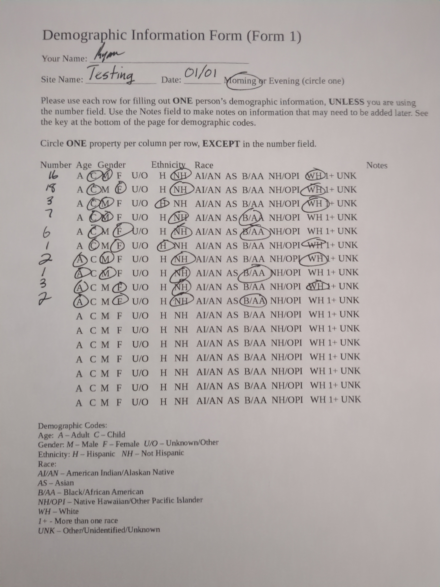

# How to use `gas-demoman`

*A preface*: some things in this document won't really make sense.
This is because this program manages demographic information to ensure compliance with anti-discrimination law.
Please don't stage an armed insurrection against me -- some statements will just look weird in the current political context.

*Thanks!*

## Installation

Firstly, navigate to [here](https://raw.githubusercontent.com/stupidcomputer/gas-demoman/main/Code.gs) and copy paste all of the text.
If you don't copy all of it, the program won't work.

Next, create a new Google Sheet. Once you get there, click on the "Extensions" tab and then click the "Apps Script" option. 

You'll see a new window pop up. In this window, delete the following:

```js
function myFunction() {
  
}
```

and replace it with the text you copied earlier.
Click the save button, and then click the run button and follow the dialogs.

Go back to the original Google Sheets tab, and click reload.
There should now be a Demographic Manager tab -- click on it, and then click on the Initialize option.

Your spreadsheet is now setup for generating statistics.

[Click here for a video explanation of the above.](./demo.mp4)

## Usage

Consider the following form:



How can we put this into our spreadsheet?

Firstly, we need to configure the intern data, so navigate to the Google Sheets tab titled "*Intern Data".
For every intern, you enter their first name, last name (*this is optional*), gender (Male/Female/Other/Unknown), ethnicity (Hispanic/Not Hispanic), and race (American Indian/Alaskan Native, Asian, Black/African American, Native Hawaiian/Other Pacific Islander, White, More then one race, or Other/Unknown).

Let's image some interns: John, Mary, and Steve.
Let's enter their data into the intern data sheet.

| First name | Last name | Gender | Ethnicity | Race |
|---|---|---|---|---|
| John | Doe | Male | Not Hispanic | White |
| Mary | Jane | Female | Not Hispanic | Asian |
| Steve | Lastname | Male | Not Hispanic | Black/African American |

You can omit the Last name column if all your first names are unique.

We have our intern data now, so we need to configure this site visit.
Go to the "*Site Information" tab.
There are six fields:

1. Site name -- this is obvious.
2. Date -- Write a date and time in the box and Google Sheets will convert it into the correct format. For example, "1/1/2024 11:00 AM".
3. Those present -- Write a series of intern names, seperated by commas. For example, "Intern 1, Intern 2, etc."
4. Data leads -- Write the data leads from the site, seperated by commas.
5. On-site lead(s) -- Write the on-side lead or leads.
6. Who collected? -- Write who collated the data (that's you!)

Let's try with this site:

| Site name | Date | Those present | Data leads | On-site Lead(s) | Who collected? |
|---|---|---|---|---|---|
| Testing | 1/1/2024 3:00 PM | John Doe, Mary Jane, Steve Lastname | Steve | Mary | John |

One thing to note: if you didn't specify a last name for a person, you can just refer to them by their first name only in the "Those present" column.

Okay, we're almost done. Now we need to enter the demographic data.
Go to the "*Demographic Data" tab.
Here's how I would transcribe the form in the spreadsheet:

| Site name | Count | Age | Gender | Ethnicity | Race |
|---|---|---|---|---|---|
| Testing | 16 | Child | Male | Not Hispanic | White |
| Testing | 18 | Child | Female | Not Hispanic | White |
| Testing | 3 | Child | Male | Hispanic | White |
| Testing | 7 | Child | Male | Not Hispanic | Black/African American |
| Testing | 6 | Child | Female | Not Hispanic | Black/African American |
| Testing | 1 | Child | Female | Hispanic | White |
| Testing | 2 | Adult | Male | Not Hispanic | White |
| Testing | 1 | Adult | Male | Not Hispanic | Black/African American |
| Testing | 3 | Adult | Female | Not Hispanic | White |
| Testing | 2 | Adult | Female | Not Hispanic | Black/African American |

Note how the site name, "Testing", is exactly the same as it is defined in the Site information spreadsheet -- this is important.
If they deviate even a little bit, the calculation won't work.

Now it's time to generate the report. Click on the "Demographic Manager" tab, and then click on "Regenerate Reporting Spreadsheets".
You should see some spreadsheets being magically created, and when you look at them you'll see sites and their respective data.

Whenever you make a change to a sheet with an asterisk in front of it, the sheets with the greater than symbol do not synchronize automatically. You need to repopulate them manually by clicking on the "Regenerate Reporting Spreadsheets" button.

### I've got an error message

Below is a series of error messages you may get when using this software, and an explanation of what might have gone wrong.

**Couldn't find an intern -- skipping**

This means that the software couldn't find an intern listed in one of the individuals present within the Site Information sheet.
Make sure that each person who you reference in the "Those Present" column actually exist in the "Intern Data" sheet, and this error goes away.

## Questions?

If you have any questions, email [me](mailto:ryan@beepboop.systems).